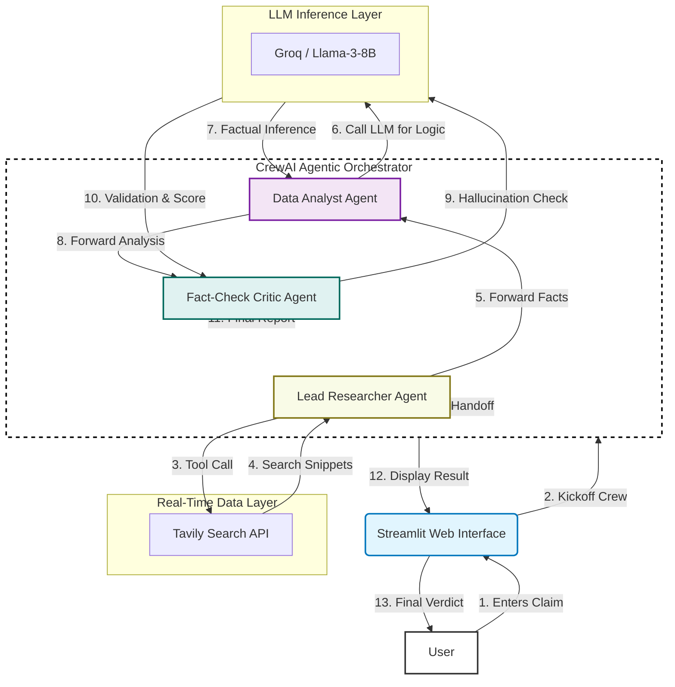
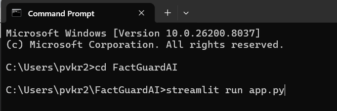
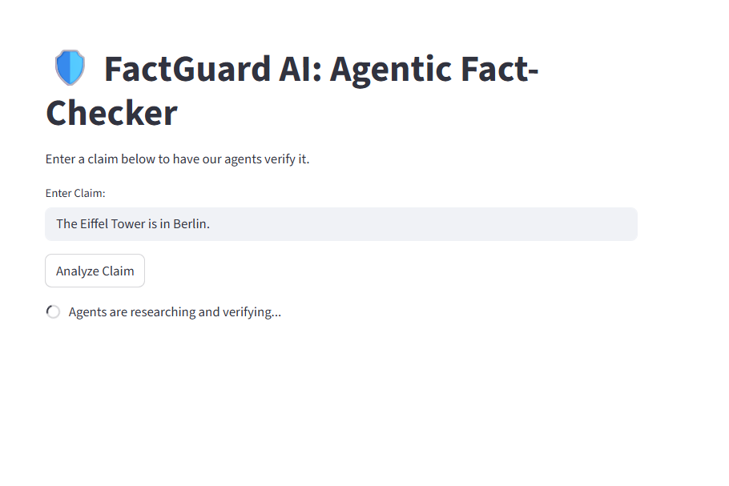
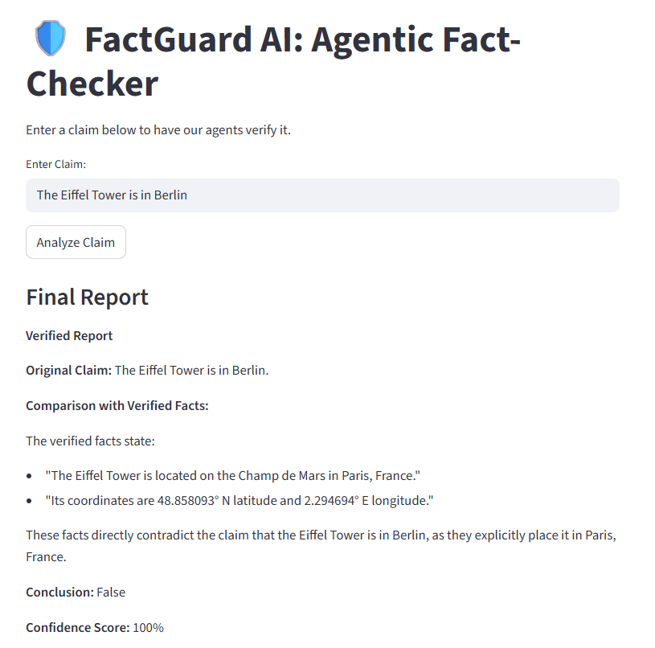

#### 🛡️ **FactGuard AI: Autonomous Deep Research \& Fact-Checker**

###### **1. Business Problem**

In the era of Generative AI, hallucinations (where AI generates confident but false information) and the rapid spread of misinformation pose significant risks to businesses, journalists, and researchers. Relying on a single LLM "brain" often results in outdated or biased data. There is a critical need for a system that doesn't just "chat," but actively researches, cross-references, and validates information against primary sources before presenting it to the user.

###### **2. Possible Solution**

A multi-agent orchestrator that separates the "thinking" process into distinct roles:

* **A Searcher :** To find real-time data from the live web.
* **An Analyst :** To filter noise and extract core facts.
* **A Critic (Guardrail) :** To act as a final quality gate, ensuring the output matches the evidence and isn't just an LLM guess.

###### **3. Implemented Solution**

FactGuard AI is a multi-agent system built on CrewAI and powered by Groq / Llama-3-8B. It uses a Sequential Agentic Pattern to verify user claims:

* **Lead Researcher** : Breaks the claim into queries and uses Tavily Search to find 5+ high-authority sources.
* **Data Analyst** : Processes the raw search results into structured factual bullet points.
* **Fact-Check Critic** : Compares the final report against the gathered evidence to calculate a Confidence Score and flag inconsistencies.

###### **4. Tech Stack Used**

* **Orchestration Framework** : CrewAI
* **LLM (Brain)** : Groq / Llama-3-8B
* **Search Infrastructure** : Tavily AI
* **Interface** : Streamlit
* **Deployment** : Hugging Face Spaces
* **Environment Management** : Python 3.12, python-dotenv

###### **5. Architecture Diagram**

###### **6. How to Run Locally**

* **Prerequisites:** Python 3.12
* **API Keys:** Groq , Tavily AI.
* **Setup Steps:**

&#x20;       i) Clone the Repo:

&#x20;             git clone https://github.com/Vinay8074240/FactGuardAI.git

&#x20;             cd FactGuardAI

&#x20;       ii) Install Dependencies:

&#x20;              pip install -r requirements.txt

&#x20;       iii) Configure Environment:

&#x20;              Create a .env file in the root:

&#x20;                GROQ\_API\_KEY=your\_groq\_key

&#x20;                TAVILY\_API\_KEY=your\_tavily\_key

&#x20;        iv) Run the App:

&#x20;               streamlit run app.py

###### 

###### **7. Problems Faced \& Solutions**

1. **Problem:** Open AI Quota Limit: Encountered 429 Insufficient Quota during testing.
**Solution:** Migrated the LLM backend to  Groq / Llama-3-8B using crewai[litellm] for a more sustainable free tier.
2. **Problem:** Python Version Conflict: Python 3.14 (bleeding edge) caused library installation failures.
**Solution:** Downgraded local environment to Python 3.12, ensuring compatibility with pre-built "wheels" for NumPy and CrewAI.
3. **Problem:** Agent Hallucinations: Initial researcher agents accepted blog posts as "facts."

&#x20;      **Solution:** Refined the Critic Agent's system prompt to strictly enforce a "Source-First" policy, requiring 100% citation for every claim.

###### **8. References and Resources**

* CrewAI Documentation
* Tavily Search API Guide
* Hugging Face Streamlit Deployment Guide

###### **9. Recording**

https://github.com/user-attachments/assets/46bfa03c-dc5e-46df-87d9-51547b006ed0

###### **10. Screenshots**

